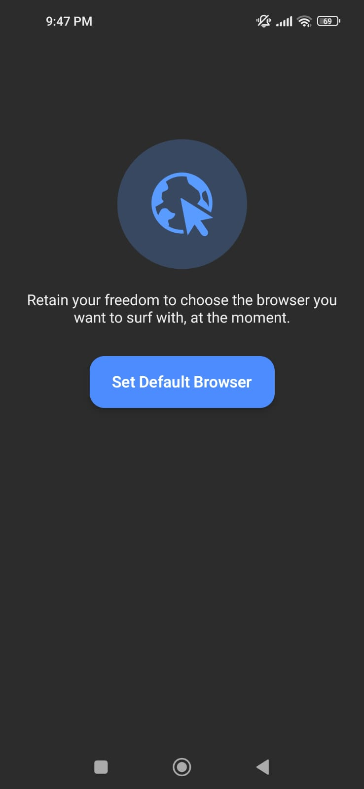

# Pick-Your-Browser 🚀

[](https://kotlinlang.org/)
[](https://developer.android.com/jetpack/compose)
[](https://developer.android.com/)

Pick-Your-Browser is an Android application that allows users to **retain their freedom to choose which browser** opens web links on their device. It provides a clean, intuitive interface with guided steps for setting the default browser.

---

## 🌟 Features

- **Set Default Browser**: Quickly select your preferred browser.
- **Incognito Mode Support**: Open links in private mode.
- **Step-by-Step Guide**: Animated instructions for easy setup.
- **Minimal UI**: Built with Jetpack Compose for modern, smooth UI.
- **GIF Animations**: Visual guidance during setup.
- **Compatibility**: Android 11+ support with modern browsers.

---
## 📸 Screenshots

<div style="display: flex; gap: 10px; justify-content: center;">

  
  
  

</div>


---

## 🛠 Tech Stack

- **Language**: Kotlin  
- **UI Framework**: Jetpack Compose  
- **Minimum SDK**: 24  
- **Target SDK**: 36  
- **Libraries Used**:  
  - AndroidX Core KTX  
  - AndroidX Lifecycle  
  - Material3  
  - [android-gif-drawable](https://github.com/koral--/android-gif-drawable)  

---

## ⚡ Installation

1. Clone the repository:

```bash
git clone https://github.com/shashanksing7/Pick-You-Browser.git
