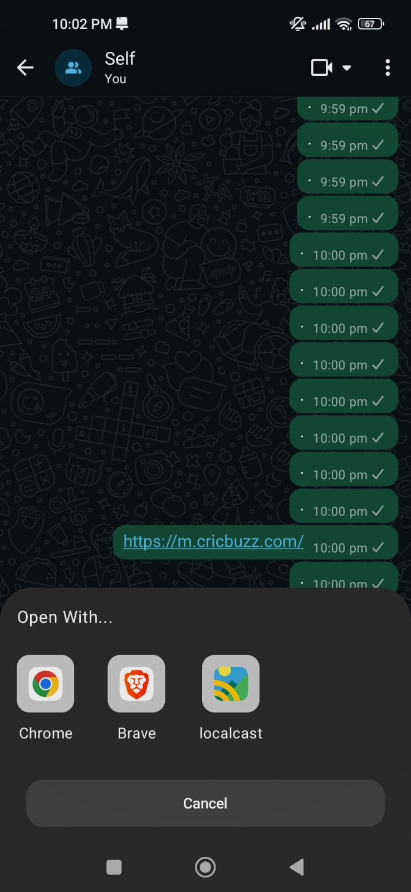

# Pick Your Browser

**Restore your freedom to choose your browser!**

Recent versions of Android often force users to set a single default browser, limiting flexibility.  
**Pick Your Browser** brings back the freedom to select the browser that best suits your needs for each link — giving you full control over your browsing experience.

---

## 🚀 Features

- Pick a browser for every link individually  
- Supports all installed browsers  
- Simple and intuitive interface  
- Works seamlessly on Android 13 and 14  
- Lightweight and battery-friendly  

---

## ⚙️ Setup & Usage

### Step 1: Enable Pick Your Browser as Default
1. Open **Settings** on your device.  
2. Go to **Apps → Default Apps → Browser App**.  
3. Select **Pick Your Browser** as your default browser.

### Step 2: Open a Link
1. Open any link from another app.  
2. **Pick Your Browser** will intercept the link and show a list of installed browsers.  
3. Select the browser you want to open the link with.  

> 💡 Optional: You can choose to remember your selection for future links.

---

## 📱 Screenshots

<p align="center">
  
  
  
</p>

---
## 🧩 Installation

### Option 1: 🔽 Download APK
You can directly download the latest version of **Pick Your Browser** from the [Releases](https://github.com/yourusername/PickYourBrowser/releases) page.

1. Go to the **[Releases](https://github.com/yourusername/PickYourBrowser/releases)** section.  
2. Download the latest `.apk` file.  
3. Install it on your Android device.  
4. Follow the **Setup & Usage** steps above.

> ⚠️ You may need to enable “Install from Unknown Sources” in your device settings.

---

### Option 2: 🧑‍💻 Build from Source

1. Clone the repository:
   ```bash
   git clone https://github.com/yourusername/PickYourBrowser.git

